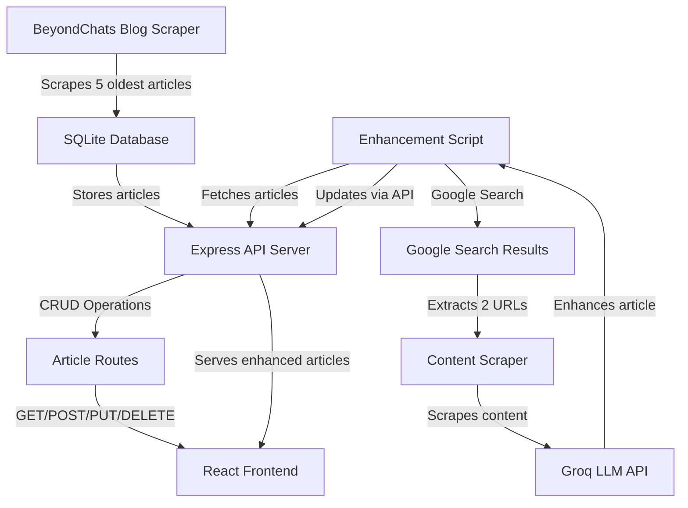

# BeyondChats Full Stack Assignment

A full-stack web application that scrapes articles from BeyondChats, enhances them using AI, and displays them in a modern React frontend.

## Project Overview

This project consists of three main phases:

1. **Phase 1**: Scrape articles from BeyondChats blogs and store them in SQLite database with CRUD APIs
2. **Phase 2**: Enhance articles using Google Search results and Groq LLM API
3. **Phase 3**: Display articles in a responsive React frontend

## Architecture Diagram



## Tech Stack

### Backend
- **Node.js** with Express.js
- **SQLite** (better-sqlite3) for database
- **Cheerio** for web scraping
- **Axios** for HTTP requests
- **Groq SDK** for LLM integration

### Frontend
- **React** with Vite
- **React Router** for navigation
- **Tailwind CSS** for styling
- **Axios** for API calls

## Local Setup Instructions

### Prerequisites
- Node.js (v16 or higher)
- npm or yarn

### Backend Setup

1. Install dependencies:
```bash
npm install
```

2. Create a `.env` file in the root directory:
```env
GROQ_API_KEY=your_groq_api_key_here
PORT=5000
DATABASE_PATH=./articles.db
```

3. Start the backend server:
```bash
npm start
# or for development with auto-reload:
npm run dev
```

The server will run on `http://localhost:5000`

### Frontend Setup

1. Navigate to the frontend directory:
```bash
cd frontend
```

2. Install dependencies:
```bash
npm install
```

3. Create a `.env` file in the frontend directory (optional):
```env
VITE_API_URL=http://localhost:5000/api/articles
```

4. Start the development server:
```bash
npm run dev
```

The frontend will run on `http://localhost:5173` (or another port if 5173 is occupied)

## Usage

### 1. Scrape Articles

Make a POST request to scrape articles:
```bash
curl -X POST http://localhost:5000/api/articles/scrape
```

Or use the API endpoint in your frontend/Postman.

### 2. Enhance Articles

Run the enhancement script:
```bash
npm run enhance
```

This script will:
- Fetch all original articles
- Search Google for each article title
- Scrape content from top 2 search results
- Use Groq LLM to enhance the article
- Save the enhanced version to the database

### 3. View Articles

Open the frontend application in your browser and browse articles. You can filter by:
- All Articles
- Original Articles
- Enhanced Articles

## API Endpoints

### Articles

- `GET /api/articles` - Get all articles (optional query: `?version=original` or `?version=updated`)
- `GET /api/articles/:id` - Get a single article by ID
- `POST /api/articles` - Create a new article
- `PUT /api/articles/:id` - Update an article
- `DELETE /api/articles/:id` - Delete an article
- `POST /api/articles/scrape` - Scrape articles from BeyondChats

## Data Flow

1. **Scraping Phase**: The scraper navigates to the last page of BeyondChats blogs and extracts the 5 oldest articles
2. **Storage**: Articles are stored in SQLite database with metadata (title, URL, excerpt, author, image, published date)
3. **Enhancement Phase**: 
   - Script fetches original articles from API
   - Searches Google for each article title
   - Scrapes content from top 2 blog/article URLs found
   - Sends original article + reference articles to Groq LLM
   - LLM enhances the article to match reference style
   - Enhanced article is saved with version="updated" and references
4. **Display Phase**: React frontend fetches articles from API and displays them with filtering options

## Project Structure

```
BeyondChats/
├── server/
│   ├── database.js          # SQLite database setup
│   ├── server.js            # Express server
│   ├── models/
│   │   └── Article.js       # Article model with CRUD methods
│   ├── routes/
│   │   └── articles.js       # Article API routes
│   ├── scraper/
│   │   └── scrapeBlogs.js   # Blog scraping logic
│   ├── utils/
│   │   ├── googleSearch.js  # Google search scraping
│   │   ├── scrapeContent.js # Content extraction utility
│   │   └── groqClient.js    # Groq LLM integration
│   └── scripts/
│       └── enhanceArticle.js # Article enhancement script
├── frontend/
│   ├── src/
│   │   ├── components/
│   │   │   ├── ArticleList.jsx
│   │   │   ├── ArticleCard.jsx
│   │   │   └── ArticleDetail.jsx
│   │   ├── api/
│   │   │   └── articles.js
│   │   ├── App.jsx
│   │   └── main.jsx
│   └── package.json
├── package.json
└── README.md
```

## Environment Variables

### Backend (.env)
- `GROQ_API_KEY` - Your Groq API key
- `PORT` - Server port (default: 5000)
- `DATABASE_PATH` - SQLite database file path (default: ./articles.db)

### Frontend (.env)
- `VITE_API_URL` - Backend API URL (default: http://localhost:5000/api/articles)

## Notes

- The scraper may need adjustments based on BeyondChats website structure changes
- Google search scraping may be rate-limited or blocked - consider using SerpAPI or Google Custom Search API for production
- The enhancement script includes delays to avoid rate limiting
- SQLite database file (`articles.db`) will be created automatically on first run


## License

ISC

